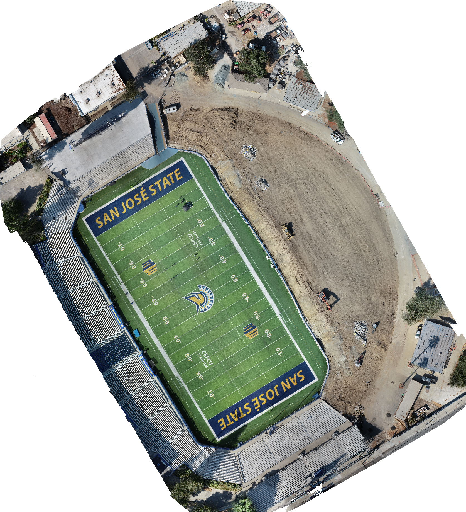
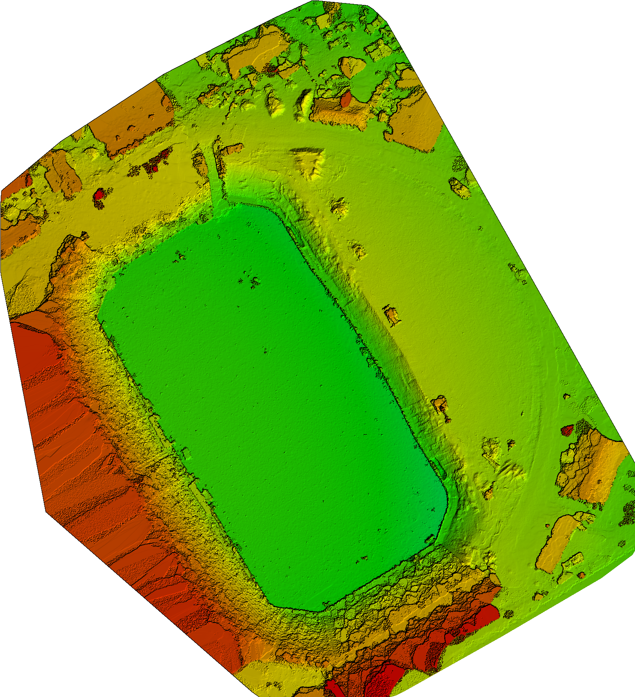

# SJSU Stadium UAV Mapping — GeoFly Lab

High-resolution drone mapping products of CEFCU Stadium at San José State University, produced by the GeoFly Lab.

## Background

CEFCU Stadium (formerly Spartan Stadium) is the home football venue of the San José State Spartans, located on the SJSU campus in San José, California. The stadium opened in 1933 as a 4,000-seat facility and was expanded several times over the following decades; it was renamed CEFCU Stadium in 2016 under a naming-rights agreement with Citizens Equity First Credit Union. At the time of this September 2021 survey, grounds adjacent to the field were undergoing active construction work, visible in the raw imagery as graded dirt and staging areas alongside the turf.

## Survey Details

- **Date:** September 21, 2021
- **Platform:** DJI Phantom 4 Pro
- **Raw images:** 396 aerial photos (~3.2 GB), 100% calibrated/used in processing
- **Ground Sampling Distance (GSD):** 0.74 cm/px
- **Area covered:** ~6.8 acres (2.76 ha)

Imagery was processed photogrammetrically to generate both 2D and 3D mapping products of the stadium field and surrounding grounds.

## Products

| Product | Format | Size |
|---|---|---|
| 2D Orthomosaic | GeoTIFF | 1.3 GB |
| 2D DSM (Digital Surface Model) | GeoTIFF | 1.4 GB |
| 2D DTM (Digital Terrain Model) | GeoTIFF | 72 MB |
| 3D Point Cloud | LAS / SLPK | 1.3 GB |
| 3D Mesh | SLPK (textured) | 109 MB |

**Total processed data: ~4.0 GB**, generated from 3.2 GB of raw UAV imagery.

### Orthomosaic Preview

### DSM Preview

## Data

Full-resolution products (orthomosaic, DSM, DTM, point cloud, 3D mesh) are available here:

- **Download:** https://1drv.ms/f/c/ba0211e33f251ba8/IgCoGyU_4xECIIC6BkQQAAAAAT2p6lH_v5yjju8PCJ2HkJo?e=BoKehj
- **Password:** `geofly`

## Credit

Produced by the GeoFly Lab.

Sources: [CEFCU Stadium (Wikipedia)](https://en.wikipedia.org/wiki/CEFCU_Stadium), [SJSU Athletics — CEFCU Stadium](https://sjsuspartans.com/cefcu-stadium)
